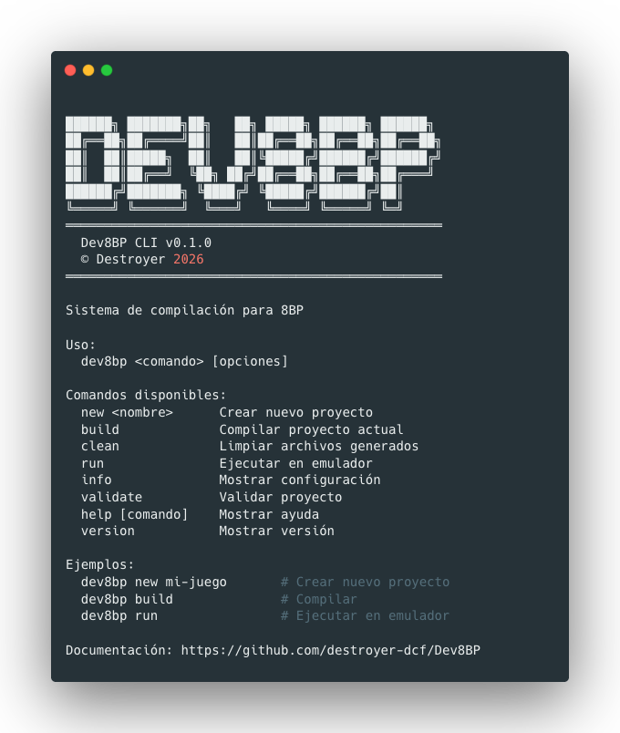

# Dev8BP CLI - Sistema de Compilación para 8BP

[](LICENSE.md)
[]()
[](https://www.python.org/)
[](https://github.com/fragarco/abasm)
[]()
[](https://github.com/jjaranda13/8BP)

---


## 🎯 ¿Por qué Dev8BP CLI?

Esta idea nace de la necesidad de poder compilar la librería [8BP](https://github.com/jjaranda13/8BP) para Amstrad CPC en sistemas operativos que no fueran Windows de forma nativa. Gracias al ensamblador [ABASM](https://github.com/fragarco/abasm) creado por [fragarco](https://github.com/fragarco) todo esto ha sido posible. En este proyecto se encuentran las herramientas necesarias para poder realizar todo esto.

<p align="center">
  
</p>


---

## � ¿Qué incluye?

### Compilación automatizada
- ✅ **8BP** - Librería de programación para Amstrad CPC
- ✅ **ASM** - Código ensamblador 8BP (make_all_*.asm)
- ✅ **BASIC** - Archivos BASIC (se añaden al DSK)
- ✅ **RAW** - Archivos binarios sin encabezado AMSDOS
- ✅ **C** - Código C compilado con SDCC
- ✅ **8BP0.BIN** - Archivo binario de 8BP (make_all_*.bin)
- ✅ **MI_JUEGO.DSK** - Generacion de DSK

### Herramientas integradas
- ✅ **[ABASM](https://github.com/fragarco/abasm)** - Ensamblador para Z80
- ✅ **[dsk.py](https://github.com/fragarco/abasm)** - Gestión de imágenes DSK
- ✅ **hex2bin** - Conversión para código C (multiplataforma)
- ✅ **[png2asm.py](https://github.com/javy-fernandez/8bp-graphics-converter)** - Conversión automática de PNG a ASM

### Herramientas Opcionales

- [SDCC](http://sdcc.sourceforge.net/) Small Device C Compiler
- [RetroVirtualMachine](https://www.retrovirtualmachine.org/) Emulaodr Amstrad CPC

### Plataformas soportadas
- ✅ macOS (ARM64 y x86_64)
- ✅ Linux (ARM64 y x86_64)
- ✅ Windows (WSL o Git Bash)

## 📦 Requisitos
- **Python 3.x** (para scripts)
- **ABASM** (ensamblador Z80) - instalado automáticamente
- **SDCC** (compilador C) - opcional, solo si usas C
- **RetroVirtualMachine** - opcional, solo si usas `dev8bp run`

‼️ **Importante:** Solo esta soportada la version v2.0 BETA-1 R7 (10/07/2019) de Retro Virtual Machine que es la unica que tiene las opciones de desarrollo activadas, tal y como se indica en su su [Web](https://www.retrovirtualmachine.org/blog/future/).

Si decides utilizar la conversion de imagenes a ASM necesitaras instalar la libreria de python Pillow en tu sistema.

1. **Python 3 y Pillow**
   ```bash
   # Instalar Pillow
   pip3 install Pillow
   
   # Verificar
   python3 -c "import PIL; print('Pillow OK')"
   ```


### 📌 Roadmap
- ✅ Conversion de imagenes a asm 
- 🚧 Creacion de imagenes de cinta CDT
- 🚧 Soporte para pruebas en M4Board
- 🚧 Soporte para proyectos asm (No 8BP)
- 🚧 Compilacion bas a binarios con abasc


## 🚀 Como Empezar

### 1. Instalación

```bash
# Clonar el repositorio
git clone https://github.com/destroyer-dcf/Dev8BP.git
cd Dev8BP

# Ejecutar instalación
./setup.sh

# Recargar shell
source ~/.bashrc  # o ~/.zshrc en macOS
```

### 2. Crear tu primer proyecto

```bash
# Crear nuevo proyecto
dev8bp new mi-juego

# Ver la estructura creada
ls -la
```

### 3. Configurar el proyecto

Edita `dev8bp.conf` según tus necesidades:

```bash
# Configuración básica
PROJECT_NAME="mi-juego"
BUILD_LEVEL=0

# Rutas (comenta las que no uses)
BP_ASM_PATH="ASM"
BASIC_PATH="bas"
#RAW_PATH="raw"
#C_PATH="C"
```

### 4. Añadir tu código

```bash
# Copiar tus archivos ASM
cp /ruta/a/tus/archivos/*.asm ASM/

# Copiar archivos BASIC
cp /ruta/a/tus/archivos/*.bas bas/
```

### 5. Compilar

```bash
# Compilar todo
dev8bp build

# Ver el resultado
ls -la dist/
```

### 6. Ejecutar (opcional)

```bash
# Configurar emulador en dev8bp.conf
# RVM_PATH="/ruta/a/RetroVirtualMachine"
# CPC_MODEL=464
# RUN_FILE="8BP0.BIN"

# Ejecutar
dev8bp run
```

---

## 📚 Comandos Disponibles

### `dev8bp new <nombre>`
Crea un nuevo proyecto con estructura completa.

```bash
dev8bp new mi-super-juego
```

**Crea:**
- Directorios: `ASM/`, `bas/`, `obj/`, `dist/`, `assets/sprites/`, `assets/screens/`
- Archivo de configuración: `dev8bp.conf`
- `README.md` con instrucciones
- `.gitignore` configurado

---

### `dev8bp build`
Compila el proyecto completo.

```bash
dev8bp build
```

**Proceso:**
1. ✅ Convierte sprites PNG a ASM (si `SPRITES_PATH` está definido)
2. ✅ Compila código ASM con ABASM (si `BP_ASM_PATH` está definido)
3. ✅ Verifica límites de gráficos (`_END_GRAPH < 42040`)
4. ✅ Crea imagen DSK
5. ✅ Añade binario ASM al DSK (8BP0.bin, 8BP1.bin, etc.)
6. ✅ Añade archivos BASIC al DSK (si `BASIC_PATH` está definido)
7. ✅ Añade archivos RAW al DSK (si `RAW_PATH` está definido)
8. ✅ Compila código C con SDCC (si `C_PATH` está definido)
9. ✅ Verifica límites de memoria C (< 23999)
10. ✅ Muestra catálogo del DSK


**Ejemplo de salida:**
```
═══════════════════════════════════════
  Compilar Proyecto: mi-juego
═══════════════════════════════════════

ℹ Build Level: 0 (Todas las funcionalidades)
ℹ Memoria BASIC: MEMORY 23599

✓ Compilación exitosa
✓ Límite de gráficos respetado (< 42040)
✓ DSK creado
✓ 1 archivo(s) BASIC añadidos

Catálogo del DSK:
0: 8BP0    .BIN  [ st: 0 extend: 0 data pages: 128 ]
1: LOADER  .BAS  [ st: 0 extend: 0 data pages: 3 ]

✓ Proyecto compilado exitosamente
```

---

### `dev8bp clean`
Limpia archivos generados.

```bash
dev8bp clean
```

**Elimina:**
- Directorio `obj/` (archivos intermedios)
- Directorio `dist/` (DSK generado)
- Archivos backup en `ASM/` (*.backup, *.bak)

---

### `dev8bp info`
Muestra la configuración del proyecto.

```bash
dev8bp info
```

**Muestra:**
- Nombre del proyecto
- Build level y descripción
- Rutas configuradas
- Directorios de salida
- Configuración del emulador

**Ejemplo:**
```
═══════════════════════════════════════
  Configuración del Proyecto
═══════════════════════════════════════

Proyecto:        mi-juego
Build Level:     0

Rutas configuradas:
  ✓ ASM:    ASM
  ✓ BASIC:  bas

Directorios:
  Objetos:  obj
  Salida:   dist
  DSK:      mi-juego.dsk
```

---

### `dev8bp validate`
Valida el proyecto antes de compilar.

```bash
dev8bp validate
```

**Verifica:**
- ✅ Configuración correcta
- ✅ Rutas existen
- ✅ Archivos necesarios presentes
- ✅ Herramientas instaladas (Python, SDCC)

**Ejemplo:**
```
═══════════════════════════════════════
  Validar Proyecto: mi-juego
═══════════════════════════════════════

→ Validando configuración...
✓ PROJECT_NAME: mi-juego
✓ BUILD_LEVEL: 0 (Todas las funcionalidades)

→ Validando rutas...
✓ BP_ASM_PATH: ASM
✓   make_all_mygame.asm encontrado
✓ BASIC_PATH: bas (2 archivo(s) .bas)

→ Validando herramientas...
✓ Python 3 instalado

═══════════════════════════════════════
  Resumen de Validación
═══════════════════════════════════════

✓ Proyecto válido - Sin errores ni advertencias
```

---

### `dev8bp run`
Ejecuta el DSK en RetroVirtualMachine.

```bash
dev8bp run
```

**Requisitos:**
- RetroVirtualMachine instalado
- `RVM_PATH` configurado en `dev8bp.conf`

**Características:**
- Cierra sesiones anteriores automáticamente
- Carga el DSK generado
- Auto-ejecuta archivo si `RUN_FILE` está configurado

> **‼️ Importante:**
> Para poder probar sobre el Emulador RetroVirtualMachine, es necesario tener instalada la version **v2.0 BETA-1 R7 10/07/2019** Que tal y como informa su desarrollador en la [Web](https://www.retrovirtualmachine.org/blog/future/) es la que tiene habilitada la funcionalidad para desarrollo.

---

### `dev8bp help`
Muestra ayuda general.

```bash
dev8bp help
```


---

### `dev8bp version`
Muestra la versión.

```bash
dev8bp version
```

---

## ⚙️ Configuración (dev8bp.conf)

### Configuración básica

```bash
# Nombre del proyecto (usado para el DSK)
PROJECT_NAME="MI_JUEGO"

# Nivel de compilación (0-4)
BUILD_LEVEL=0
```

### Niveles de compilación 8BP

| Nivel | Descripción | MEMORY | Comandos | Tamaño |
|-------|-------------|--------|----------|--------|
| **0** | Todas las funcionalidades | 23599 | \|LAYOUT, \|COLAY, \|MAP2SP, \|UMA, \|3D | 19120 bytes |
| **1** | Juegos de laberintos | 24999 | \|LAYOUT, \|COLAY | 17620 bytes |
| **2** | Juegos con scroll | 24799 | \|MAP2SP, \|UMA | 17820 bytes |
| **3** | Juegos pseudo-3D | 23999 | \|3D | 18620 bytes |
| **4** | Sin scroll/layout | 25299 | Básicos | 17320 bytes |

### Rutas opcionales

```bash
# Código ensamblador 8BP
BP_ASM_PATH="ASM"

# Archivos BASIC (se añaden al DSK automáticamente)
BASIC_PATH="bas"

# Archivos RAW (se añaden sin encabezado AMSDOS)
RAW_PATH="raw"

# Código C (se compila con SDCC)
C_PATH="C"
C_SOURCE="main.c"
C_CODE_LOC=20000
```

**Nota:** 
- `BP_ASM_PATH`: Ruta al código ensamblador 8BP (make_all_mygame.asm)
- Todas las rutas son opcionales - comenta las que no uses
- Solo se procesan las rutas definidas

### Directorios de salida

```bash
# Archivos intermedios (bin, lst, map, ihx)
OBJ_DIR="obj"

# DSK final
DIST_DIR="dist"

# Nombre del DSK
DSK="${PROJECT_NAME}.dsk"
```

### Emulador (opcional)

```bash
# macOS
RVM_PATH="/Applications/Retro Virtual Machine 2.app/Contents/MacOS/Retro Virtual Machine 2"

# Linux
#RVM_PATH="/usr/local/bin/RetroVirtualMachine"

# Windows WSL
#RVM_PATH="/mnt/c/Program Files/RetroVirtualMachine/RetroVirtualMachine.exe"

# Modelo de CPC
CPC_MODEL=464

# Archivo a ejecutar automáticamente
RUN_FILE="8BP0.BIN"
```

---

## 📁 Estructura de Proyecto

### Proyecto típico

```
mi-juego/
├── dev8bp.conf          # Configuración del proyecto
├── README.md            # Documentación
├── .gitignore          # Git ignore
│
├── ASM/                # Código ensamblador 8BP (BP_ASM_PATH)
│   ├── make_all_mygame.asm    # Archivo principal
│   ├── images_mygame.asm      # Gráficos
│   ├── music_mygame.asm       # Música
│   └── sprites.asm            # Sprites generados (si usas SPRITES_PATH)
│
├── bas/                # Archivos BASIC (BASIC_PATH)
│   ├── loader.bas      # Cargador
│   └── menu.bas        # Menú
│
├── assets/             # Recursos del proyecto
│   └── sprites/        # Sprites PNG (SPRITES_PATH por defecto)
│       ├── player.png
│       ├── enemies/
│       └── tiles/
│
├── raw/                # Archivos RAW (RAW_PATH) - opcional
│   └── data.bin        # Datos sin encabezado AMSDOS
│
├── C/                  # Código C (C_PATH) - opcional
│   ├── main.c          # Código principal
│   ├── 8BP_wrapper/    # Wrapper para 8BP
│   └── mini_BASIC/     # Mini BASIC
│
├── obj/                # Generado: archivos intermedios
│   ├── 8BP0.bin        # Binario compilado
│   ├── *.lst           # Listados
│   ├── *.map           # Mapas de memoria
│   └── *.ihx           # Intel HEX (C)
│
└── dist/               # Generado: DSK final
    └── mi-juego.dsk    # Imagen DSK lista para usar
```

### Variables de configuración

| Variable | Descripción | Ejemplo | Requerido |
|----------|-------------|---------|-----------|
| `PROJECT_NAME` | Nombre del proyecto | `"MI_JUEGO"` | ✅ Sí |
| `BUILD_LEVEL` | Nivel de compilación (0-4) | `0` | ✅ Sí |
| `BP_ASM_PATH` | Ruta al código ASM 8BP | `"ASM"` | ❌ Opcional |
| `BASIC_PATH` | Ruta a archivos BASIC | `"bas"` | ❌ Opcional |
| `RAW_PATH` | Ruta a archivos RAW | `"raw"` | ❌ Opcional |
| `C_PATH` | Ruta a código C | `"C"` | ❌ Opcional |
| `C_SOURCE` | Archivo C principal | `"main.c"` | ❌ Si C_PATH |
| `C_CODE_LOC` | Dirección de carga C | `20000` | ❌ Si C_PATH |
| `OBJ_DIR` | Directorio objetos | `"obj"` | ❌ Opcional |
| `DIST_DIR` | Directorio salida | `"dist"` | ❌ Opcional |
| `DSK` | Nombre del DSK | `"${PROJECT_NAME}.dsk"` | ❌ Opcional |
| `RVM_PATH` | Ruta al emulador | `"/path/to/RVM"` | ❌ Opcional |
| `CPC_MODEL` | Modelo de CPC | `464` | ❌ Opcional |
| `RUN_FILE` | Archivo a ejecutar | `"8BP0.BIN"` | ❌ Opcional |
| `SPRITES_PATH` | Ruta a PNG para convertir | `"GRAFICOS"` | ❌ Opcional |
| `MODE` | Modo CPC (0, 1 o 2) | `0` | ❌ Opcional |
| `SPRITES_OUT_FILE` | Archivo ASM de salida | `"sprites.asm"` | ❌ Opcional |
| `SPRITES_TOLERANCE` | Tolerancia RGB | `8` | ❌ Opcional |
| `SPRITES_TRANSPARENT_INK` | INK transparente (0-26) | `""` | ❌ Opcional |

---

## 🎨 Conversión de Gráficos PNG a ASM

Dev8BP incluye una herramienta automática para convertir tus sprites PNG a formato ASM compatible con Amstrad CPC.


### Configuración

```bash
# En dev8bp.conf

# Ruta donde están tus PNG (búsqueda recursiva)
SPRITES_PATH="assets/sprites"

# Modo CPC (0=16 colores, 1=4 colores, 2=2 colores)
MODE=0

# Archivo ASM de salida (puede incluir ruta)
SPRITES_OUT_FILE="ASM/sprites.asm"

# Tolerancia RGB (0=exacto, 8=recomendado, -1=automático)
SPRITES_TOLERANCE=8

# INK para píxeles transparentes (opcional, 0-26)
SPRITES_TRANSPARENT_INK=""
```

### Modos CPC

| Modo | Colores | Píxeles/byte | Bits/píxel | Resolución |
|------|---------|--------------|------------|------------|
| **0** | 16 | 2 | 4 | 160x200 |
| **1** | 4 | 4 | 2 | 320x200 |
| **2** | 2 | 8 | 1 | 640x200 |

### Paleta de Colores CPC

La herramienta convierte automáticamente los colores RGB de tus PNG a los 27 INKs del Amstrad CPC:

```
INK 0  = Negro (0,0,0)
INK 1  = Azul oscuro (0,0,128)
INK 2  = Azul (0,0,255)
INK 3  = Rojo oscuro (128,0,0)
INK 4  = Magenta oscuro (128,0,128)
INK 5  = Magenta (128,0,255)
INK 6  = Rojo (255,0,0)
INK 7  = Rosa (255,0,128)
INK 8  = Rosa claro (255,0,255)
INK 9  = Verde oscuro (0,128,0)
INK 10 = Cian oscuro (0,128,128)
INK 11 = Cian (0,128,255)
INK 12 = Amarillo oscuro (128,128,0)
INK 13 = Gris (128,128,128)
INK 14 = Azul pastel (128,128,255)
INK 15 = Naranja (255,128,0)
INK 16 = Rosa pastel (255,128,128)
INK 17 = Lila (255,128,255)
INK 18 = Verde (0,255,0)
INK 19 = Verde agua (0,255,128)
INK 20 = Cian claro (0,255,255)
INK 21 = Amarillo verdoso (128,255,0)
INK 22 = Verde pastel (128,255,128)
INK 23 = Cian pastel (128,255,255)
INK 24 = Amarillo (255,255,0)
INK 25 = Amarillo pastel (255,255,128)
INK 26 = Blanco (255,255,255)
```

### Estructura de Carpetas

```
mi-juego/
├── assets/                # Recursos del proyecto
│   └── sprites/           # Tus PNG originales
│       ├── player.png
│       ├── enemies/
│       │   ├── enemy1.png
│       │   └── enemy2.png
│       └── tiles/
│           ├── tile1.png
│           └── tile2.png
│
└── ASM/
    └── sprites.asm        # Generado automáticamente
```

### Uso

```bash
# 1. Coloca tus PNG en la carpeta assets/sprites/
# 2. Configura SPRITES_PATH en dev8bp.conf
SPRITES_PATH="assets/sprites"
# 3. Compila normalmente
dev8bp build
```

La conversión se ejecuta automáticamente antes de compilar el ASM.

### Formato del ASM Generado

```asm
; MODE 0

PLAYER
;------ BEGIN IMAGE --------
  db 2 ; ancho en bytes
  db 16 ; alto
  db 0, 0
  db 0, 0
  db 85, 85
  ; ... más bytes
;------ END IMAGE --------
  ; Paleta (PEN -> INK) detectada en el PNG
  ; INK 0,0
  ; INK 1,24
  ; INK 2,6

ENEMY1
;------ BEGIN IMAGE --------
  db 2 ; ancho en bytes
  db 16 ; alto
  ; ... bytes
;------ END IMAGE --------
  ; INK 0,0
  ; INK 1,2
```

### Requisitos de los PNG

1. **Ancho**: Debe ser múltiplo de:
   - Modo 0: múltiplo de 2 píxeles
   - Modo 1: múltiplo de 4 píxeles
   - Modo 2: múltiplo de 8 píxeles

2. **Colores**: Máximo:
   - Modo 0: 16 colores
   - Modo 1: 4 colores
   - Modo 2: 2 colores

3. **Paleta**: Usa colores de la paleta CPC (o cercanos con tolerancia)

### Tolerancia RGB

La tolerancia define cuánto puede diferir un color del PNG de la paleta CPC:

```bash
# Exacto (solo colores CPC exactos)
SPRITES_TOLERANCE=0

# Recomendado (permite pequeñas variaciones)
SPRITES_TOLERANCE=8

# Automático (siempre encuentra el color más cercano)
SPRITES_TOLERANCE=-1
```

### Transparencia

Puedes definir un INK para píxeles transparentes (alpha=0):

```bash
# Píxeles transparentes = INK 0 (negro)
SPRITES_TRANSPARENT_INK=0
```

### Ejemplo Completo

```bash
# 1. Crear proyecto
dev8bp new mi-juego
cd mi-juego

# 2. Copiar tus PNG a la carpeta de sprites
cp /ruta/a/sprites/*.png assets/sprites/

# 3. Configurar dev8bp.conf
SPRITES_PATH="assets/sprites"
MODE=0
SPRITES_OUT_FILE="ASM/sprites.asm"
SPRITES_TOLERANCE=8

# 4. Compilar
dev8bp build
```

**Salida:**
```
═══════════════════════════════════════
  Convertir Sprites PNG a ASM
═══════════════════════════════════════

ℹ Ruta sprites:    assets/sprites
ℹ Modo CPC:        0
ℹ Archivo salida:  ASM/sprites.asm
ℹ Tolerancia RGB:  8

ℹ Ejecutando png2asm.py...

OK: ASM/sprites.asm
PNGs encontrados: 3  | Convertidos OK: 3  | Errores: 0

Resumen:
PNG           Label      Size(px)  Bytes/line  Colors  Fallback  Status
player.png    player     16x16     2           4       no        OK
enemy1.png    enemy1     16x16     2           3       no        OK
tile1.png     tile1      8x8       1           2       no        OK

✓ Sprites convertidos exitosamente
```

### Usar los Sprites en tu Código

```asm
; En tu make_all_mygame.asm
include "sprites.asm"

; Usar los sprites
ld hl, PLAYER
call |PSPRITE

ld hl, ENEMY1
call |PSPRITE
```

### Solución de Problemas

**Error: "Pillow no instalado"**
```bash
pip3 install Pillow
```

**Error: "ancho no divisible"**
- Modo 0: ancho debe ser par (2, 4, 6, 8, 10, 12, 14, 16...)
- Modo 1: ancho debe ser múltiplo de 4 (4, 8, 12, 16, 20...)
- Modo 2: ancho debe ser múltiplo de 8 (8, 16, 24, 32...)

**Error: "usa X INKs pero MODE permite Y"**
- Reduce los colores de tu PNG
- Usa un modo con más colores (0 = 16, 1 = 4, 2 = 2)

**Error: "Color no coincide con paleta CPC"**
- Aumenta la tolerancia: `SPRITES_TOLERANCE=16`
- O usa tolerancia automática: `SPRITES_TOLERANCE=-1`
- O ajusta los colores del PNG a la paleta CPC

---

## 🔧 Compilación de Código C

### Requisitos

1. **SDCC instalado**
   ```bash
   # macOS
   brew install sdcc
   
   # Linux
   sudo apt-get install sdcc
   
   # Verificar
   sdcc --version
   ```

2. **Estructura de carpetas**
   ```
   C/
   ├── main.c
   ├── 8BP_wrapper/
   │   └── 8BP.h
   └── mini_BASIC/
       └── minibasic.h
   ```

### Configuración

```bash
C_PATH="C"
C_SOURCE="main.c"
C_CODE_LOC=20000    # Dirección de carga (debe ser < 23999)
```

### Límites de memoria

‼️ **Importante:** El código C no debe exceder la dirección **23999 (0x5DBF)** para no destruir la librería 8BP.

**Si excedes el límite:**
```bash
# Usa una dirección más baja
C_CODE_LOC=19000

# Y en BASIC:
MEMORY 18999
```

### Uso desde BASIC

```basic
10 REM Cargar 8BP con gráficos
20 MEMORY 23599
30 LOAD"8BP0.bin"
40 CALL &6B78
50 REM Cargar tu código C
60 LOAD"main.BIN",20000
70 CALL &56B0    ' Dirección de _main (ver .map)
```

---

## 🎮 Uso con RetroVirtualMachine

### Configuración

```bash
# En dev8bp.conf
RVM_PATH="/Applications/Retro Virtual Machine 2.app/Contents/MacOS/Retro Virtual Machine 2"
CPC_MODEL=464
RUN_FILE="8BP0.BIN"
```

### Ejecutar

```bash
# Compilar y ejecutar
dev8bp build && dev8bp run

# Solo ejecutar (si ya compilaste)
dev8bp run
```

### Características

- ✅ Cierra sesiones anteriores automáticamente
- ✅ Carga el DSK/CDT generado
- ✅ Auto-ejecuta el archivo especificado
- ✅ Funciona en background

---

### ¿Qué es BUILD_LEVEL?

El BUILD_LEVEL determina qué funcionalidades de 8BP se incluyen:

- **0**: Todas las funcionalidades (19120 bytes, MEMORY 23599)
- **1**: Solo laberintos (17620 bytes, MEMORY 24999)
- **2**: Solo scroll (17820 bytes, MEMORY 24799)
- **3**: Solo pseudo-3D (18620 bytes, MEMORY 23999)
- **4**: Básico sin scroll/layout (17320 bytes, MEMORY 25299)

Usa el nivel más alto posible para tener más memoria BASIC disponible.

### ¿Cómo sé qué BUILD_LEVEL usar?

Depende de los comandos 8BP que uses en tu juego:

- Usas `|LAYOUT` o `|COLAY`? → Nivel 0 o 1
- Usas `|MAP2SP` o `|UMA`? → Nivel 0 o 2
- Usas `|3D`? → Nivel 0 o 3
- No usas ninguno? → Nivel 4

### ¿Puedo cambiar BUILD_LEVEL después?

Sí, simplemente cambia el valor en `dev8bp.conf` y recompila:

```bash
# Editar dev8bp.conf
BUILD_LEVEL=2

# Recompilar
dev8bp clean
dev8bp build
```

### ¿Qué hace make_all_mygame.asm?

Es el archivo principal que incluye todos los demás archivos ASM de tu proyecto. Dev8BP modifica automáticamente la variable `ASSEMBLING_OPTION` en este archivo según tu `BUILD_LEVEL`.

### ¿Puedo usar mi propio ensamblador?

No, Dev8BP está diseñado específicamente para usar ABASM con la librería 8BP. ABASM está incluido y no necesitas instalarlo.

### ¿Funciona en Windows?

Sí, pero necesitas WSL (Windows Subsystem for Linux) o Git Bash. El sistema está diseñado para entornos Unix (bash).

### ¿Cómo actualizo Dev8BP?

```bash
cd Dev8BP
git pull origin main
./setup.sh
```

### ¿Dónde está la documentación de 8BP?

La documentación completa de 8BP está en el [repositorio oficial de 8BP](https://github.com/jjaranda13/8BP).

---

## 📖 Ejemplos Completos

### Ejemplo 1: Proyecto solo ASM

```bash
# Crear proyecto
dev8bp new juego-asm
cd juego-asm

# Configurar (dev8bp.conf)
PROJECT_NAME="juego-asm"
BUILD_LEVEL=0
BP_ASM_PATH="ASM"

# Copiar código
cp /ruta/a/make_all_mygame.asm ASM/

# Compilar
dev8bp build
```

### Ejemplo 2: Proyecto ASM + BASIC

```bash
# Crear proyecto
dev8bp new juego-completo
cd juego-completo

# Configurar
PROJECT_NAME="juego-completo"
BUILD_LEVEL=0
BP_ASM_PATH="ASM"
BASIC_PATH="bas"

# Copiar archivos
cp /ruta/a/*.asm ASM/
cp /ruta/a/*.bas bas/

# Compilar
dev8bp build
```

### Ejemplo 3: Proyecto con C

```bash
# Crear proyecto
dev8bp new juego-c
cd juego-c

# Configurar
PROJECT_NAME="juego-c"
BUILD_LEVEL=0
BP_ASM_PATH="ASM"
C_PATH="C"
C_SOURCE="main.c"
C_CODE_LOC=20000

# Copiar archivos
cp /ruta/a/*.asm ASM/
cp /ruta/a/main.c C/
cp -r /ruta/a/8BP_wrapper C/
cp -r /ruta/a/mini_BASIC C/

# Compilar
dev8bp build
```

---

## 📄 Licencia

MIT License - Copyright (c) 2026 Destroyer

---

## 🙏 Agradecimientos

- **[jjaranda13](https://github.com/jjaranda13)** - Creador de [8BP](https://github.com/jjaranda13/8BP)
- **[fragarco](https://github.com/fragarco)** - Creador de [ABASM](https://github.com/fragarco/abasm)
- **[Javi Fernandez](https://github.com/javy-fernandez)** - Creador de [8bp-graphics-converter](https://github.com/javy-fernandez/8bp-graphics-converter)
---

## 📚 Recursos Adicionales

### Documentación de 8BP

- [Repositorio oficial de 8BP](https://github.com/jjaranda13/8BP)
- [Manual de 8BP (PDF)](https://github.com/jjaranda13/8BP/blob/master/8BP_MANUAL.pdf)
- [Ejemplos de 8BP](https://github.com/jjaranda13/8BP/tree/master/examples)


---

## 🐞 Bugs

Si encuentras un Bug o deseas plantear alguna mejora ¡Compártelo!

- [Bugs - Mejoras](https://github.com/destroyer-dcf/Dev8BP/issues)


---

## 📞 Contacto

© Destroyer 2026 - [destroyer.dcf@gmail.com](mailto:destroyer.dcf@gmail.com)
